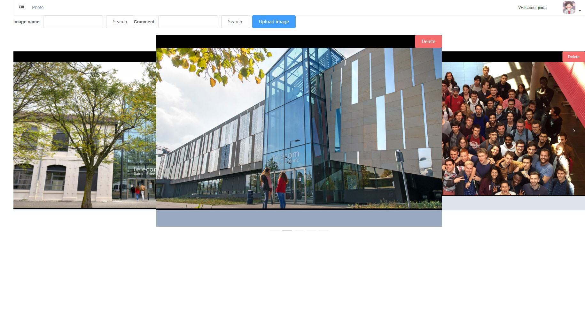
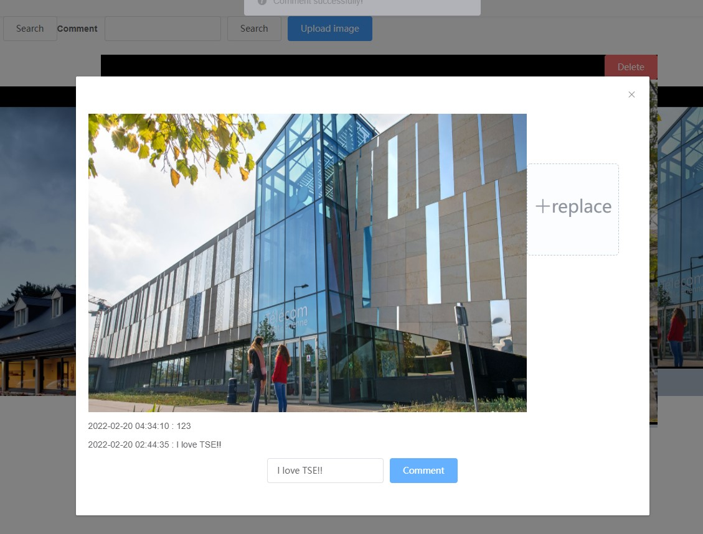

# PhotoShare-ProjetN-tiers

School Architecture N-Tiers project with Springboot + Vue + MySQL. This web program is designed to handle photos.
> Made by [WU Jinda](https://github.com/WUJinda)
Demo show on Youtube: [Link](https://youtu.be/0PiaXWrdxRo) 

## Subject
Objective: share in a synchronized way your last vacation photos.
For this, you will set up a web architecture allowing to
- 1.Deposit, modify and destroy photos, each of the photos being associated with a comment
- 2. The deposit must be able to be made photo by photo or by lot.
- 3.View photos in slideshow mode
- 4.Search a particular photo based on a comment
- 5.Consult the photos in synchronized mode between several clients connected at the same time on the same url (if one of the clients goes to the next photo, all the other connected clients also see the next photo)

## Screenshots

## Technical stack 

Front-end will be built using Vue.js + Bootstrap.
Back-end will be built using Springboot with database MySQL.

## Development server

Before run back-end, you need to configure `application.properties`, you need to modify the database name, and the user name and password are the same as those of the local MySQL.
   
Install vue.js   
> `npm install vue`   

Install vue-cli   
> `npm install --global vue-cli`    

Before run front-end, you need to enter `npm install` on the command line to install the required installation package in the configuration file
Run `npm run dev` in Terminal for front-end. The app in angular will automatically reload if you change any of the source files.

